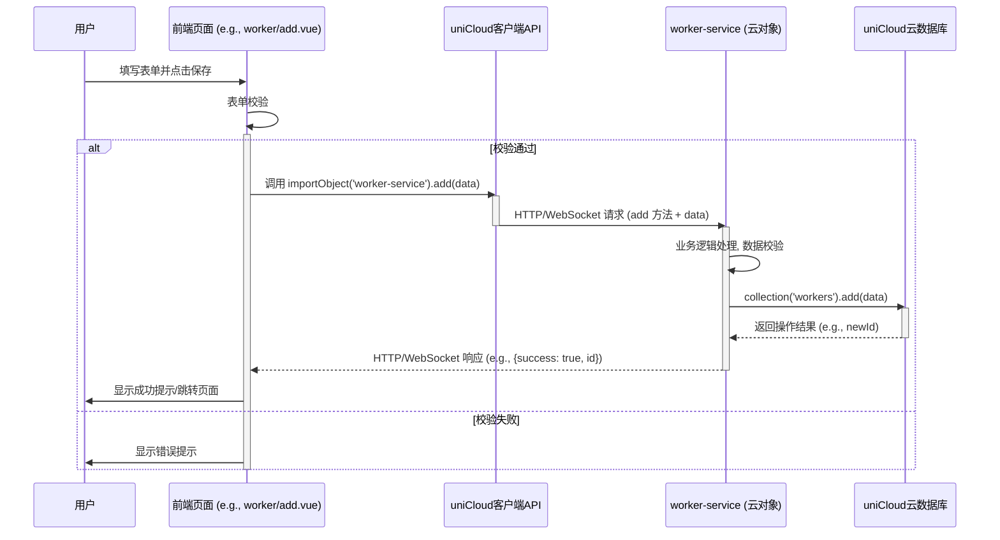

# 项目架构文档

## 1. 项目架构概览

本项目是一个基于 `uni-app` 框架和 `uniCloud` 服务端一体化方案开发的记工时微信小程序。

- **前端框架**: `uni-app`，一套代码可以编译到多个平台（本项目主要针对微信小程序）。
- **UI 组件库**: 初期使用 `uView UI 1.x`，后期部分组件替换为 `uni-app` 内置组件或自定义组件。
- **服务端**: `uniCloud`，提供云函数、云数据库、云存储等服务，实现了前后端一体化开发。本项目使用了阿里云作为 `uniCloud` 的服务商。
- **状态管理**: 可能使用 `Vuex` (需要检查 `store` 目录)。
- **开发模式**: 前后端分离，前端负责界面展示和用户交互，后端（`uniCloud` 云函数）负责业务逻辑处理和数据存储。

## 2. 主要目录结构及其职责

```
create-uniapp-template/
├── .hbuilderx/            # HBuilderX 编辑器项目配置
├── components/            # uni-app 全局复用组件
│   ├── advanced-filter/   # 高级筛选组件
│   └── common-empty/      # 通用空状态组件
├── docs/                  # 项目文档
│   ├── arch.md            # 项目架构文档 (本文档)
│   ├── devlog.md          # 开发记录
│   ├── task.md            # 开发任务清单
│   └── 统一入口处理登录校验方案.md # 关于云对象统一登录校验的方案文档
├── pages/                 # 业务页面存放目录
│   ├── me/                # 我的页面 (登录)
│   ├── index/             # 应用首页
│   ├── site/              # 工地管理相关页面
│   ├── tabbar/            # 底部导航栏页面 (示例或模板)
│   │   ├── site/
│   │   └── worker/
│   ├── worker/            # 工人管理相关页面 (如列表、新增、详情)
│   └── worker-hour/       # 工时记录相关页面 (如列表、新增)
├── prototype/             # UI 原型或设计稿 (推测)
├── static/                # 存放静态资源 (图片、字体等)
│   ├── images/
│   │   ├── common/
│   │   └── tabbar/
├── store/                 # Vuex 状态管理
│   └── modules/           # Vuex 模块 (如 demo.js，其具体业务用途待进一步明确)
├── style/                 # 全局样式文件
├── uni_modules/           # uni-app 插件模块 (DCloud插件市场下载的插件)
│   ├── uni-badge/         # 徽标数组件
│   ├── uni-calendar/      # 日历组件
│   ├── uni-captcha/       # 验证码组件
│   ├── uni-cloud-s2s/     # uniCloud s2s 调用库
│   ├── uni-config-center/ # uniCloud 配置中心
│   ├── uni-data-checkbox/ # 数据驱动的复选框组件
│   ├── uni-easyinput/     # 增强输入框组件
│   ├── uni-forms/         # 表单组件
│   ├── uni-icons/         # 图标组件
│   ├── uni-id-common/     # uni-id 公共模块
│   ├── uni-id-pages/      # uni-id 页面模板和组件 (用户中心、登录注册等)
│   ├── uni-list/          # 列表组件
│   ├── uni-load-more/     # 加载更多组件
│   ├── uni-open-bridge-common/ # uniCloud 云函数/云对象之间调用公共模块
│   ├── uni-popup/         # 弹出层组件
│   ├── uni-scss/          # uni-app scss 扩展
│   └── uni-transition/    # 过渡动画组件
├── uniCloud-aliyun/       # uniCloud 服务空间 (阿里云)
│   ├── cloudfunctions/    # 云函数/云对象目录
│   │   ├── common/        # 公共模块/云函数
│   │   │   └── auth-filter/ # 鉴权过滤器 (推测)
│   │   ├── site-service/  # 工地管理相关云对象
│   │   ├── user-service/  # 用户服务相关云对象 (可能与uni-id配合)
│   │   ├── work-hour-service/ # 工时记录相关云对象
│   │   └── worker-service/ # 工人管理相关云对象
│   └── database/          # 云数据库表结构 schema 文件
├── unpackage/             # 项目编译后的输出目录
├── utils/                 # 工具函数库
├── .gitignore             # Git 忽略配置
├── .prettierrc.js         # Prettier 代码格式化配置
├── App.vue                # uni-app 应用入口文件，可调用应用生命周期函数
├── index.html             # H5 端模板文件
├── main.js                # Vue 初始化入口文件
├── manifest.json          # uni-app 应用配置，如AppID、图标、权限等
├── package-lock.json      # npm 依赖版本锁定文件
├── package.json           # npm 项目描述和依赖管理文件
├── pages.json             # uni-app 页面路由和全局样式配置
├── uni.promisify.adaptor.js # uni-app API Promise 封装适配器
└── uni.scss               # uni-app 内置的常用 SCSS 变量
```

**职责说明:**

- **`components`**: 存放可复用的 UI 组件，提高代码复用性和维护性。`advanced-filter` 和 `common-empty` 是业务相关的全局组件。
- **`docs`**: 存放项目相关的文档，便于团队协作和后续维护。
- **`pages`**: 核心业务模块的页面实现，如工人管理 (`worker`)、工地管理 (`site`)、工时管理 (`worker-hour`)。
- **`static`**: 存放图片、字体等静态资源。
- **`store`**: 使用 Vuex 进行全局状态管理，例如用户信息、全局配置等。
- **`uni_modules`**: 存放从 DCloud 插件市场安装的插件，这些插件通常提供了特定的功能或 UI 组件，如 `uni-id-pages` (用户身份认证)、`uni-forms` (表单)、`uni-popup` (弹出层) 等。
- **`uniCloud-aliyun`**: 项目的后端核心，包含了云函数（业务逻辑处理）和数据库表结构定义。
  - `cloudfunctions`: 存放所有云函数/云对象。命名方式如 `xxx-service` 表明其为一个业务逻辑服务。
  - `database`: 存放数据库表的 schema 文件，定义了数据表的结构、字段类型、权限等。
- **`utils`**: 存放项目通用的工具函数，如日期格式化、请求封装等。
- **`App.vue`**: 应用的根组件，可以处理应用的生命周期事件，如 `onLaunch`, `onShow`, `onHide`。
- **`main.js`**: Webpack 打包的入口文件，用于初始化 Vue 实例、引入全局组件、插件等。
- **`manifest.json`**: 应用的配置文件，非常重要，配置了应用名称、版本、图标、权限、各个平台的特定设置等。
- **`pages.json`**: 配置应用的页面路径、窗口表现、导航栏、底部 tab 等。
- **`.prettierrc.js`**: 代码格式化工具 Prettier 的配置文件，用于统一代码风格。
- **`uni.scss`**: 定义了 uni-app 的一些全局 SCSS 变量，方便在样式中使用。

接下来，我将分析关键模块的依赖关系。

## 3. 关键模块的依赖关系图

项目的核心业务模块包括：用户模块、工人管理、工地管理、工时记录和工时统计。这些模块之间的依赖关系主要体现在页面对组件的调用、页面对 Vuex 状态的读写以及页面对 uniCloud 云服务的请求。

**主要依赖路径：**

- **页面 (`pages/`)**:

  - 调用 **全局组件 (`components/`)** 如 `advanced-filter` 进行复杂筛选操作。
  - 调用 **`uni_modules/`** 中的 UI 组件 (如 `uni-forms`, `uni-popup`, `uni-calendar` 等) 构建用户界面。
  - 调用 **`uni_modules/uni-id-pages/`** 组件处理用户登录、注册等流程。
  - 通过 `uniCloud.importObject` 或 `uniCloud.callFunction` 调用 **云对象/云函数 (`uniCloud-aliyun/cloudfunctions/`)** 来获取和提交业务数据。
    - `pages/worker/*` -> `worker-service`
    - `pages/site/*` -> `site-service`
    - `pages/worker-hour/*` -> `work-hour-service`
    - 某些页面可能也会调用 `user-service` (例如，获取当前用户信息) 或 `uni-id-co` (处理登录状态)。
  - 读写 **Vuex 状态 (`store/`)**，例如获取当前登录用户的 `userId`，或存储一些全局共享的数据。

- **全局组件 (`components/`)**:

  - 自身可能封装了部分 **`uni_modules/`** 中的基础 UI 组件。
  - 可能会派发事件，由父级页面处理，间接触发对云函数或 Vuex 的操作。

- **Vuex Store (`store/`)**:

  - 目前定义了一个 `demo` 模块，并通过 `vuex-persistedstate` 将状态持久化到 `uni.setStorageSync`。
  - 提供了一个 `userId` 的 `getter`，推测用于从 `state.demo.userId` 获取用户 ID。
  - 页面和组件可以通过 `mapState`, `mapGetters`, `mapActions`, `mapMutations` 等辅助函数与 Vuex 交互。

- **uniCloud 云函数/云对象 (`uniCloud-aliyun/cloudfunctions/`)**:
  - **`xxx-service` (业务云对象)**: 封装核心业务逻辑，直接操作云数据库。
    - `worker-service`: 负责工人信息的增删改查。
    - `site-service`: 负责工地信息的增删改查，以及工地与工人的关联。
    - `work-hour-service`: 负责工时记录的增删改查和统计。
  - **`uni-id-co` (用户中心云对象)**: 由 `uni-id-pages` 依赖，处理用户注册、登录、密码修改、Token 管理等身份认证相关逻辑。是用户体系的核心。
  - **`user-service` (自定义用户服务)**: 可能是在 `uni-id-co` 基础上进行的扩展，提供更具体的业务相关的用户操作接口。
  - **`common/` 目录下的云函数/模块**: 可能包含一些被其他云函数共享的工具函数或配置，例如 `auth-filter` (权限过滤器)。
  - **云数据库 (`database/`)**: 存储所有业务数据和用户信息，云函数通过 `uniCloud.database()` API 进行访问。

**依赖关系示意图 (Mermaid):**

```mermaid
graph LR
    subgraph 前端 (uni-app)
        direction LR
        Pages["页面 (pages)"]
        Components["全局组件 (components)"]
        UniModules["uni_modules (插件)"]
        Store["Vuex Store (store)"]
        Utils["工具库 (utils)"]
    end

    subgraph 后端 (uniCloud)
        direction LR
        CloudFunctions["云函数/云对象 (cloudfunctions)"]
        Database["云数据库 (database)"]
    end

    Pages -- 调用 --> Components
    Pages -- 使用 --> UniModules
    Pages -- "读/写" --> Store
    Pages -- "调用 (HTTP/WebSocket)" --> CloudFunctions
    Components -- 使用 --> UniModules

    CloudFunctions -- "操作 (CRUD)" --> Database
    CloudFunctions -- "可能互相调用" --> CloudFunctions
    CloudFunctions -- "使用公共模块" --> CloudFunctionsCommon["公共云函数/模块 (common)"]
    UniModules -- "(如 uni-id-pages) 调用" --> CloudFunctions

    %% 具体业务依赖
    PageWorker["工人管理页面 (pages/worker)"] --> WorkerService["worker-service (云对象)"]
    PageSite["工地管理页面 (pages/site)"] --> SiteService["site-service (云对象)"]
    PageWorkHour["工时记录页面 (pages/worker-hour)"] --> WorkHourService["work-hour-service (云对象)"]
    PageLogin["登录注册页面 (uni-id-pages)"] --> UniIdCO["uni-id-co (云对象)"]

    WorkerService -- 操作 --> Database
    SiteService -- 操作 --> Database
    WorkHourService -- 操作 --> Database
    UniIdCO -- 操作 --> Database

    Store -- "持久化 (userId等)" --> LocalStorage["uni.storage"]

```

接下来分析数据流向。

## 4. 数据流向图

数据流主要起始于用户在前端页面的操作，经由 `uniCloud` 云函数处理后，与云数据库交互，最终将结果返回给前端展示。

**典型数据流路径 (以新增工人为例):**

1.  **用户操作 (前端)**: 用户在 `pages/worker/add.vue` 页面填写工人信息，点击"保存"按钮。
2.  **表单提交 (前端)**:
    - 页面触发提交事件。
    - 调用 `uni-forms` 组件进行表单校验。
    - 校验通过后，收集表单数据。
3.  **调用云对象 (前端)**:
    - 通过 `uniCloud.importObject('worker-service')` 获取云对象实例。
    - 调用云对象的 `add` 方法 (或其他类似方法)，将工人数据作为参数传递。
    - `console.log` 打印请求参数和即将调用的云函数/方法。
    ```javascript
    // 示例代码 (pages/worker/add.vue)
    const workerService = uniCloud.importObject('worker-service')
    async function saveWorker(formData) {
    	console.log('即将调用 worker-service.add，参数：', formData)
    	try {
    		const res = await workerService.add(formData)
    		console.log('worker-service.add 调用成功，返回：', res)
    		// 处理成功逻辑，如提示、跳转
    	} catch (err) {
    		console.error('worker-service.add 调用失败，错误：', err)
    		// 处理失败逻辑，如提示错误信息
    	}
    }
    ```
4.  **云对象处理 (后端 - `worker-service` 云对象)**:
    - 接收前端传递的工人数据。
    - `console.log` 打印接收到的参数。
    - 进行数据校验、权限验证（可能通过 `auth-filter` 或 `uni-id`）。
    - 构造要存入数据库的数据对象。
    - 调用 `uniCloud.database().collection('workers').add(data)` 将数据存入 `workers` 表 (表名需确认)。
    - `console.log` 打印数据库操作结果。
    - 返回操作结果给前端 (例如 `{ success: true, id: newWorkerId }` 或错误信息)。
5.  **结果处理 (前端)**:
    - 接收云对象返回的结果。
    - 根据结果进行相应处理：
      - 成功：提示用户"添加成功"，可选择清空表单或跳转到工人列表页。
      - 失败：提示用户错误信息。

**数据流向示意图 (Mermaid):**



**通用数据查询流程 (以获取工人列表为例):**

1.  **用户操作 (前端)**: 用户进入 `pages/worker/index.vue` 页面。
2.  **页面加载 (前端)**:
    - 在 `onLoad` 或 `onShow` 生命周期中触发数据加载逻辑。
3.  **调用云对象 (前端)**:
    - 通过 `uniCloud.importObject('worker-service')` 获取云对象实例。
    - 调用云对象的 `getList` 方法 (或其他类似方法)，可传递分页、筛选等参数。
    - `console.log` 打印请求参数。
4.  **云对象处理 (后端 - `worker-service` 云对象)**:
    - 接收前端传递的查询参数。
    - `console.log` 打印接收到的参数。
    - 构造数据库查询条件。
    - 调用 `uniCloud.database().collection('workers').where(condition).skip(offset).limit(pageSize).get()` 从数据库查询数据。
    - `console.log` 打印数据库查询结果。
    - 处理查询结果，可能进行数据格式化。
    - 返回数据列表和分页信息给前端。
5.  **结果处理 (前端)**:
    - 接收云对象返回的数据。
    - 将数据绑定到页面进行展示。
    - 更新分页状态，用于上拉加载更多。

接下来分析常见的代码模式和约定。

## 5. 常见的代码模式和约定

### 5.1. API 请求封装

- **云对象调用**:

  - 项目统一通过 `uniCloud.importObject('云对象名称')` 导入云对象，然后直接调用其方法。不直接使用独立的云函数。
  - 调用时，采用 `async/await` 处理异步操作，并配合 `try...catch` 进行错误捕获。在 `catch` 块中，会检查错误对象是否包含由云端 `auth-filter` 抛出的、表示需要重新登录的 `errCode`。如果是，则调用相应方法跳转到登录页。
  - **日志**: 在调用前后及关键步骤使用 `console.log` 打印请求参数和返回结果，方便调试。

- **云对象内部 (`_before` 钩子与 `auth-filter`)**:

  - **统一登录校验**: 所有业务云对象（如 `worker-service`, `site-service`, `work-hour-service` 等）均在自身的 `_before` 方法中调用一个公共的 `auth-filter` 模块进行统一的登录状态和 Token 有效性校验。
  - **`auth-filter` 模块**:

    - **位置**: `uniCloud-aliyun/cloudfunctions/common/auth-filter/index.js`
    - **功能**: 提供一个如 `checkLogin` 的函数。该函数会：
      1. 获取客户端的 `uniIdToken`。
      2. 检查 Token 是否存在。若不存在，则抛出如 `{ errCode: 'LOGIN_REQUIRED', errMsg: '用户未登录' }` 的错误。
      3. 若 Token 存在，则调用 `uniCloud.checkToken(uniIdToken)` 或 `uni-id-co` 提供的类似方法校验 Token 的有效性。
      4. 若 Token 无效或过期，则抛出如 `{ errCode: 'TOKEN_INVALID', errMsg: '登录已过期，请重新登录' }` 的错误。
      5. 若校验通过，则函数正常返回。
    - **调用方式**: 在云对象的 `_before` 方法中，通过 `require` 或 `import` 引入 `auth-filter` 中的校验函数，并执行它。例如:

      ```javascript
      // uniCloud-aliyun/cloudfunctions/worker-service/index.obj.js
      const { checkLogin } = require('../common/auth-filter') // 假设 auth-filter 导出 checkLogin

      module.exports = {
      	_before: async function () {
      		this.startTime = Date.now()
      		const clientInfo = this.getClientInfo() // 获取客户端信息，包含token
      		console.log('worker-service _before: clientInfo.uniIdToken ->', clientInfo.uniIdToken ? 'exists' : 'null')
      		await checkLogin.call(this) // 执行登录校验，.call(this) 确保 checkLogin 内部的 this 指向云对象实例
      		console.log('worker-service _before: auth check passed')
      	},
      	// ...其他业务方法...
      	_after: function (error, result) {
      		// ... (日志记录耗时等)
      	},
      }
      ```

  - **云对象业务方法**:
    - 接收参数后，首先 `console.log` 打印入参。
    - 关键数据库操作前后也建议打印日志。
    - 返回结果时，通常包含一个业务状态码 (如 `errCode: 0` 表示成功) 和数据 (`data`) 或错误信息 (`errMsg`)。
    ```javascript
    // 云对象业务方法示例 (service-name/index.obj.js)
    // ...
    // method: async function(params) {
    //   console.log('Cloud object [service-name.method] received params:', params);
    //   const db = uniCloud.database();
    //   let response = { errCode: 0, errMsg: '操作成功', data: null };
    //
    //   try {
    //     // 业务逻辑...
    //     // const result = await db.collection('your_collection').doc(params.id).get();
    //     // console.log('Database operation result:', result);
    //     // response.data = result.data;
    //     return response;
    //   } catch (err) {
    //     console.error('Error in cloud object [service-name.method]:', err);
    //     response.errCode = 'INTERNAL_ERROR'; // 或其他业务错误码
    //     response.errMsg = err.message || '服务端发生错误';
    //     return response; // 或者直接抛出错误，由前端的 $api catch
    //   }
    // }
    // ...
    ```

### 5.2. 状态管理 (Vuex)

- 使用 Vuex (`store/index.js`) 进行全局状态管理。
- 引入了 `vuex-persistedstate` 插件，将 Vuex state 持久化到 `uni.getStorageSync` / `uni.setStorageSync`。
- 存在一个名为 `demo` 的模块 (`store/modules/demo.js`) 和一个全局 `getter` `userId` (指向 `state.demo.userId`)。其在具体业务中的用途，尤其与 `uni-id` 用户体系的关系，需要结合代码进一步明确。`uni-id` 体系自身会管理用户登录状态、`uid` 和 `token`，通常存储在 `uni.getStorageSync` 中，并通过 `uni-id-pages` 相关的 store (如果 `uni-id-pages` 使用了独立的 store 模块) 或直接 API 调用来访问。
- 页面或组件中可以通过 Vuex 提供的辅助函数 (如 `mapState`, `mapGetters`, `mapActions`, `mapMutations`) 访问和修改 `store` 中的状态。

## 6. 登录体系的实现

项目采用了 `uni-app` 官方的 `uni-id-pages` 插件和 `uni-id-common` 作为用户身份认证和管理的基础。登录功能完全通过配置 `uni-id-pages` 实现，无需自行编码用户认证逻辑。项目仅使用微信登录，并倾向于微信一键登录的便捷体验。

### 6.1. 前端实现 (`uni-id-pages` 插件)

- **位置**: `uni_modules/uni-id-pages/`
- **功能**: 提供了一套完整的、开源的、可定制的用户中心相关页面和组件，例如登录、注册、用户信息、绑定手机等。
  - 本项目主要利用其提供的微信登录流程。
- **前端页面配置**: `uni-id-pages` 提供的页面 (如 `/uni_modules/uni-id-pages/pages/login/login-withoutpwd`) 会在项目的 `pages.json` 中配置相应的路由规则，以便进行跳转。

### 6.2. 后端实现 (`uni-id-co` 云对象与配置)

- **`uni-id-co` 云对象**:
  - **位置**: `uni_modules/uni-id-pages/uniCloud/cloudfunctions/uni-id-co/`
  - **功能**: 这是 `uni-id-pages` 配套的核心云对象，封装了所有用户账户操作的后端逻辑，如登录、注册、Token 管理、用户信息管理等。前端的 `uni-id-pages` 页面会调用此云对象的方法。
- **`uni-id-common`**:
  - **位置**: `uni_modules/uni-id-common/uniCloud/cloudfunctions/common/uni-id-common/`
  - **功能**: `uni-id` 的核心逻辑库，被 `uni-id-co` 依赖，提供底层的用户身份校验、Token 生成与解析等原子能力。

### 6.3. 项目中的 `uni-id` 具体配置

项目的 `uni-id` 相关配置主要集中在 `uni_modules/uni-config-center/uniCloud/cloudfunctions/common/uni-config-center/uni-id/config.json` 文件中。关键配置项包括：

```json
{
	"passwordSecret": "[已配置密码密钥]", // 用于密码加密的密钥
	"tokenSecret": "[已配置Token密钥]", // 用于生成和校验Token的密钥
	"tokenExpiresIn": 7200, // 全局Token有效期，单位秒 (2小时)
	"tokenExpiresThreshold": 3600, // Token刷新阈值 (1小时)
	// ... 其他如密码强度、错误限制等通用配置 ...
	"mp-weixin": {
		// 微信小程序平台特定配置
		"tokenExpiresIn": 259200, // 微信小程序端Token有效期 (3天)
		"tokenExpiresThreshold": 86400, // 微信小程序端Token刷新阈值 (1天)
		"oauth": {
			"weixin": {
				// 微信登录相关配置
				"appid": "wx9c8cc81196ccbbb5", // 【重要】微信小程序的AppID
				"appsecret": "[已配置微信AppSecret]" // 【重要】微信小程序的AppSecret
			}
		}
	}
	// ... 可能还有其他平台或三方登录的配置占位 ...
}
```

- **核心安全配置**: `passwordSecret` 和 `tokenSecret` 是保障账户安全的核心，已在项目中配置 (具体值已隐去)。
- **Token 策略**: 定义了 Token 的有效期和刷新机制。
- **微信小程序配置 (`mp-weixin`)**:
  - 包含了针对微信小程序的独立 Token 有效期设置。
  - `oauth.weixin` 对象中配置了微信登录所必需的 `appid` (`wx9c8cc81196ccbbb5`) 和 `appsecret`。这是实现微信登录的关键。

### 6.4. 改造为仅支持微信一键登录

根据官方文档和 `uni-id-pages` 的设计，要实现仅微信一键登录 (或小程序端的微信授权登录)，需要以下步骤：

1.  **配置文件 (`uni_modules/uni-config-center/.../uni-id/config.json`)**:

    - 确保 `mp-weixin.oauth.weixin` 中的 `appid` 和 `appsecret` 正确配置为您的微信小程序的信息。
    - 移除或注释掉其他登录方式的 OAuth 配置（例如 `"qq"`, `"weibo"`, `"app-plus".oauth.univerify` 等，如果存在的话）。当前配置文件中未显式看到其他登录方式的 oauth 配置，说明可能默认就未开启或依赖其他地方的配置。

2.  **`uni-id-pages` 登录页面前端配置**:

    - `uni-id-pages` 插件本身提供了多种登录方式的 UI 入口。可以通过修改其前端页面的配置或代码来限制显示的登录方式。
    - 查阅 `uni-id-pages` 的文档 ([https://doc.dcloud.net.cn/uniCloud/uni-id/app.html](https://doc.dcloud.net.cn/uniCloud/uni-id/app.html))，其中提到了一个 `config.js` 文件 (通常在 `uni_modules/uni-id-pages/common/config.js` 或项目根目录的 `uni_modules/uni-id-pages/config.js`，也可能整合到 `uni-config-center` 的前端部分) 用于控制前端登录方式的显示。
    - 在该前端配置文件中，找到 `loginTypes` (或类似命名的) 配置项。
    - 将 `loginTypes` 修改为仅包含微信登录的标识。例如，对于微信小程序，通常是 `["weixin"]`。
      ```javascript
      // 示例: uni_modules/uni-id-pages/common/config.js (路径需确认)
      // export default {
      //   loginTypes: ['weixin'], // 仅保留微信登录
      //   // ... 其他前端配置 ...
      // }
      ```
    - **注意**: "微信一键登录" 通常指的是 App 端的"手机号一键登录"（依赖 `univerify` 服务）。在微信小程序中，对应的体验是"微信授权登录"，用户点击按钮后，拉起微信授权界面，同意后即可获取用户信息或手机号完成登录/注册。

3.  **`manifest.json` 配置 (针对 App 端微信登录或一键登录)**:

    - 如果涉及到 App 平台并希望使用原生微信登录或手机号一键登录，需要在 `manifest.json` 的 "App 模块配置"中勾选相应的服务（如"OAuth->微信登录"、"OAuth->一键登录(univerify)"），并填写相关平台的 AppID 等信息。
    - 对于本项目主要目标是微信小程序，此项主要关注小程序的相关配置是否正确即可。

4.  **前端页面调用**:
    - 确保所有触发登录的入口最终都导向配置好且仅显示微信登录的 `uni-id-pages` 登录页面。
    - 如果 `uni-id-pages` 支持通过 URL 参数指定登录方式 (如文档中提到的 `?type=weixin`)，也可以在跳转时固定传递该参数。

**总结**: 通过正确配置服务端的 `uni-id/config.json` (主要是微信的 `appid` 和 `appsecret`) 和前端 `uni-id-pages` 的登录类型显示配置 (`loginTypes`)，即可实现仅微信登录的需求。由于您使用的是 `uni-id-pages`，大部分复杂的交互逻辑已经被封装好了，主要工作在于正确配置。

### 6.5. `user-service` 的作用

- 项目中存在 `uniCloud-aliyun/cloudfunctions/user-service/` 云对象。
- 它作为对 `uni-id-co` 的业务层封装和扩展，用于处理与本项目具体业务逻辑更紧密相关的用户操作。例如：
  - `getCurrentUserInfo()`: 获取当前登录用户在本应用中的特定业务角色、权限、或关联的其他业务数据（如该用户创建的工人/工地信息统计等）。
  - 其他可能的接口，如更新用户在本应用内的特定偏好设置等。
- 该服务会依赖 `uni-id-co` 或 `uni-id-common` 来获取基础的用户认证信息 (如 `uid`)，然后基于此进行业务操作。

## 7. uniCloud 接口设计方案

`uniCloud` 云对象是项目的后端核心，负责处理业务逻辑和数据持久化。项目**仅使用云对象 (Cloud Object)** 的方式组织后端服务，不使用独立的云函数。

**主要业务云对象:**

- **`worker-service`** (`uniCloud-aliyun/cloudfunctions/worker-service/index.obj.js`)

  - **职责**: 管理工人信息。
  - **前置处理 (`_before`)**: 调用 `common/auth-filter/index.js` 进行登录校验。
  - **主要接口**: (通过阅读代码确认具体方法和参数)
    - `add(data)`: 新增工人。
    - `delete(id)`: 删除工人。
    - `update(id, data)`: 更新工人信息。
    - `get(id)`: 获取单个工人详情。
    - `getList(params)`: 获取工人列表，支持分页、按姓名等搜索。
    - `console.log` 记录各接口调用详情。

- **`site-service`** (`uniCloud-aliyun/cloudfunctions/site-service/index.obj.js`)

  - **职责**: 管理工地信息及工地与工人的关联关系。
  - **前置处理 (`_before`)**: 调用 `common/auth-filter/index.js` 进行登录校验。
  - **主要接口**: (通过阅读代码确认具体方法和参数)
    - `add(data)`: 新增工地。
    - `delete(id)`: 删除工地。
    - `update(id, data)`: 更新工地信息。
    - `get(id)`: 获取单个工地详情。
    - `getList(params)`: 获取工地列表。
    - `addWorkerToSite(siteId, workerId)`: 将工人添加到工地。
    - `removeWorkerFromSite(siteId, workerId)`: 从工地移除工人。
    - `getWorkersBySite(siteId)`: 获取某工地下的工人列表。
    - `console.log` 记录各接口调用详情。

- **`work-hour-service`** (`uniCloud-aliyun/cloudfunctions/work-hour-service/index.obj.js`)

  - **职责**: 管理工时记录和统计。
  - **前置处理 (`_before`)**: 调用 `common/auth-filter/index.js` 进行登录校验。
  - **主要接口**: (根据 `devlog.md` 和代码确认)
    - `saveWorkHours(data)`: 保存工时记录。
    - `delete(id)`: 删除单条工时记录。
    - `update(id, data)`: 更新单条工时记录。
    - `getWorkHourList(params)`: 获取工时记录列表。
    - `getWorkHourStats(params)`: 获取工时统计数据。
    - `console.log` 记录各接口调用详情。

- **`user-service`** (`uniCloud-aliyun/cloudfunctions/user-service/index.obj.js`)

  - **职责**: 提供与业务相关的用户服务，是对 `uni-id-co` 的补充和扩展，例如获取当前登录用户在本应用中的特定业务角色或数据，或整合 `uni-id` 用户信息与其他业务表的关联。
  - **前置处理 (`_before`)**: 调用 `common/auth-filter/index.js` 进行登录校验 (除非某些接口设计为公开)。
  - **主要接口**: (通过阅读代码确认具体方法)
    - `getCurrentUserInfo()`: 获取当前登录用户的详细业务信息。
    - `console.log` 记录各接口调用详情。

- **公共模块/过滤器**:
  - `common/auth-filter/index.js`: **已确认实现**。这是一个关键的公共模块，在各业务云对象的 `_before` 钩子中被调用，用于统一校验用户登录状态和 Token 有效性。如果校验失败，会抛出特定 `errCode` 的错误，由前端封装的 API 调用层优先处理（通常是跳转登录页）。

**接口设计通用原则**:

- **云对象方法**: 业务逻辑封装在云对象的方法中。
- **统一错误响应**: 云对象方法在发生业务错误或校验失败时，应返回包含 `errCode` (非 0) 和 `errMsg` 的对象。成功时返回 `errCode: 0` 和 `data`。
  ```json
  // 成功示例
  { "errCode": 0, "errMsg": "操作成功", "data": { ... } }
  // 失败示例
  { "errCode": "SPECIFIC_ERROR_CODE", "errMsg": "具体的错误信息" }
  ```
- **权限控制**: 通过 `common/auth-filter/index.js` 实现基础的登录校验。更细致的接口权限（如角色权限）可以在 `auth-filter` 中扩展，或在各云对象方法内部进一步判断。
- **清晰的日志**: 每个云对象方法的入口、关键步骤、数据库操作、出口都应有 `console.log` 输出。

接下来分析页面和接口交互规范。

## 8. 页面和接口交互规范

为了确保前后端协作的顺畅和代码的可维护性，应遵循以下页面与接口的交互规范：

### 8.1. 前端调用方式

- **优先使用云对象 (Cloud Object)**:

  ```javascript
  const service = uniCloud.importObject('your-service-name', {
  	// customUI: true, // 如果需要在前端处理加载提示和错误提示，而不是由uniCloud框架自动处理
  	// getParams: () => { // 可以动态获取一些公共参数，例如token
  	//   return { token: uni.getStorageSync('uni_id_token') }
  	// }
  })

  async function fetchData() {
  	uni.showLoading({ title: '加载中...' })
  	console.log('调用 your-service-name.getList，参数：', { page: 1, size: 10 })
  	try {
  		const res = await service.getList({ page: 1, size: 10 })
  		console.log('your-service-name.getList 返回结果：', res)
  		if (res.success) {
  			// 处理数据 res.data
  		} else {
  			uni.showToast({ title: res.message || '获取失败', icon: 'none' })
  		}
  	} catch (err) {
  		console.error('调用 your-service-name.getList 异常：', err)
  		uni.showToast({ title: err.message || '请求异常', icon: 'none' })
  	} finally {
  		uni.hideLoading()
  	}
  }
  ```

- 对于无复杂逻辑、仅简单 CRUD 的场景，也可以考虑使用 `clientDB`，但本项目从 `devlog.md` 看主要依赖云对象。

### 8.2. 请求参数

- **清晰命名**: 参数名应清晰表意。
- **数据类型**: 传递的参数类型应与云函数/对象中期望的类型一致。
- **分页参数**: 列表查询接口通常需要 `page` (或 `pageNum`, `offset`) 和 `pageSize` (或 `limit`) 参数。
- **Token 传递**: 需要登录授权的接口，前端应主动获取并传递 `token`。一种常见做法是通过 `uniCloud.importObject` 的 `getParams` 选项统一注入，或者云对象内部通过 `this.getClientInfo()` 获取客户端信息（包含 `token`，但这要求前端正确配置了 `uni-id` 相关的 `uni.setStorageSync('uni_id_token', token)`）。

### 8.3. 响应数据格式

云对象返回给前端的数据应遵循统一格式，便于前端处理：

```json
// 成功
{
  "errCode": 0,
  "errMsg": "操作成功", // 或具体的成功信息
  "data": {
    // 业务数据
  },
  "timeCost": 120 // 可选，服务端耗时
}

// 业务逻辑错误 (非登录/Token错误，那些由auth-filter抛出，前端封装的API调用层直接处理跳转)
{
  "errCode": "BUSINESS_ERROR_CODE", // 例如：INVALID_PARAMS, INSUFFICIENT_STOCK 等
  "errMsg": "具体的业务错误描述",
  "data": null // 或包含一些辅助错误信息
}
```

- **`errCode`**: 业务状态码。`0` 表示业务处理成功。非 `0` 表示具体的业务错误。登录相关错误（如 `LOGIN_REQUIRED`, `TOKEN_INVALID`）由 `auth-filter` 抛出，并由前端封装的 API 调用层优先处理（通常是跳转登录页），一般不会直接在业务回调的 `res` 中收到这些登录类 `errCode`。
- **`errMsg`**: 提示信息，成功或失败都应有。
- **`data`**: 仅在 `errCode` 为 `0` 时，`data` 字段才包含有效的业务数据。
- **`console.log`**: 前端在收到响应后，也应 `console.log(JSON.stringify(res))` 打印完整的响应体。

### 8.4. 错误处理

- **`try...catch`**: 前端调用云函数/对象时，必须使用 `try...catch` 包裹，捕获可能发生的网络错误或业务逻辑抛出的异常。
- **用户提示**:
  - 对于捕获到的错误，应通过 `uni.showToast` 或其他 UI 方式向用户展示友好的错误提示 (优先使用后端返回的 `message`)。
  - 避免直接展示详细的错误堆栈给普通用户。
- **日志记录**: 将错误信息 `console.error` 记录到控制台，方便开发者定位问题。
  ```javascript
  // catch (err) {
  //   console.error('API Call Error:', err);
  //   let errMsg = '请求失败，请稍后再试';
  //   if (err.message) {
  //     errMsg = err.message;
  //   } else if (err.errMsg && err.errMsg.includes('request:fail')) {
  //     errMsg = '网络连接错误，请检查网络设置';
  //   }
  //   uni.showToast({ title: errMsg, icon: 'none' });
  // }
  ```

### 8.5. 加载提示 (Loading)

- 对于耗时可能较长的请求 (如列表加载、数据提交)，前端应显示加载提示 (`uni.showLoading`)，并在请求完成 (无论成功或失败) 后隐藏 (`uni.hideLoading`)，以提升用户体验。

---

项目架构文档分析与生成完毕。
